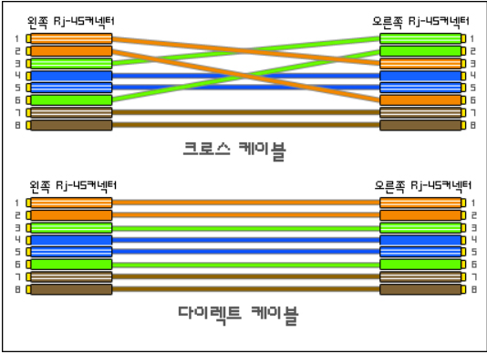

## 물리계층 : 데이러를 전기 신호로 변환하기

### 1. 물리 계층의 역할과 랜 카드의 구조

- 물리계층
  - 컴퓨터와 네트워크 장비를 연결하고 컴퓨터와 네트워크 장비 간에 전송되는 데이터를 **전기신호**로 변환하는 계층
- 랜 카드
  - 0과 1을 전기신호로 변환하는 장치

### 2. 케이블의 종류와 구조

- 트위스트 페어 케이블(LAN 케이블)
  - UTP
    - 구리 선 여덟 개를 두개씩 꼬아 만든 네쌍의 전선으로 **실드로 보호되어 있지 않은** 케이블
    - 보편적
    - 노이즈 영향 큼
  - STP
    - 두 개씩 꼬아 만든 선을 **실드로 보호한** 케이블
    - 노이즈 영향 적음

- LAN 케이블의 종류
  - 
  - 다이렉트 케이블
    - 선 여덟개를 같은 순서로 연결한 케이블
    - 컴퓨터와 스위치를 연결할 때 사용
  - 크로스 케이블
    - 1, 2번 선을 3, 6번에 연결한 케이블
    - 컴퓨터 간에 직접 랜 케이블로 연결할 때 사용(양쪽 컴퓨터에서 1번과 2번으로 데이터를 전송하면 충돌우려가 있기 때문)

### 3. 리피터와 허브의 구조

- 리피터
  - 전기신호를 **정형**하고 **증폭**하는 네트워크 중계장비
  - 일대 일 통신만 가능
  - 최근에는 보기 힘듦
- 허브
  - **포트**를 여러개 가지고 있는 네트워크 장비
  - 여러대의 컴퓨터와 통신 가능
  - 허브의 특징
    - 특정 한 포트로부터 데이터를 받으면 나머지 모든 포트로 받은 데이터를 전송함
    - **더미 허브**로도 불림
    - 이러한 이슈를 해결하기 위한 장비가 **스위치**